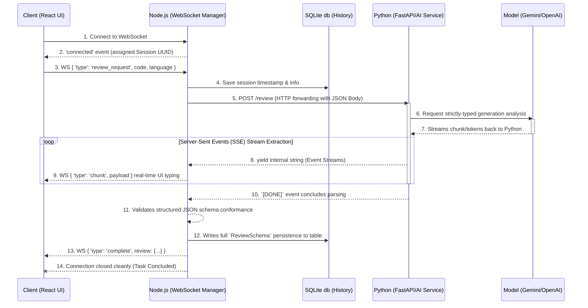

# Real-Time AI Code Review Bot

A full-stack, real-time AI code review microservice architecture. It allows developers to quickly feed code snippets into an intelligent analysis pipeline, receiving instantaneous, token-by-token structural teardowns covering bugs, styles, semantics, and security.

 

## 🧩 Structure

This project has been cleanly decoupled into three discrete robust layers:
- **/frontend (React/Vite)**
  - Split-pane editor view allowing for seamless review flow and syntax highlighting via CodeMirror.
  - Custom `useWebSocket` hooks governing automatic backoffs to maintain connection persistence naturally.
  - Strict TypeScript typings for explicit interface contracts.
  
- **/backend (Node.js)**
  - WebSocket proxy and historical tracking server built safely around Express.js.
  - Leverages fast `better-sqlite3` DB to log metrics and persist raw code sessions concurrently locally.
  - Bridges the communication boundaries securely between the Python service and user endpoints.
  
- **/ai-service (Python/FastAPI)**
  - Fast, modular Server-Sent Events (SSE) provider logic exposing the language model's mind seamlessly.
  - Utilizes powerful strict-schema integrations (`pydantic` generation configs) mapping directly into Google's Gemini / OpenAI pipelines ensuring perfectly predictable outputs.

---

## ⚡ WebSocket Data Flow

The following schema maps the interactions powering our Real-Time LLM synchronization engine smoothly across all 3 backend segments.



## 🚀 Setting Up the Suite

Each tier operates natively in its designated layer. To serve the platform efficiently, spin them up concurrently:

### Database & Node WebSocket Service
```bash
cd backend
npm install
npm run build && npm start
```

### Python Streaming Service
Ensure you have activated your preferred LLM APIs successfully (by default, `GEMINI_API_KEY` mapped inside `.env`).
```bash
cd ai-service
python3 -m venv venv
source venv/bin/activate
pip install -r requirements.txt # (or directly fastapiapp deps)
uvicorn main:app --host 0.0.0.0 --port 8000
```

### React / Frontend
```bash
cd frontend
npm install
npm run dev
```

Point your browser to `http://localhost:5173` and launch your code reviews instantly!
